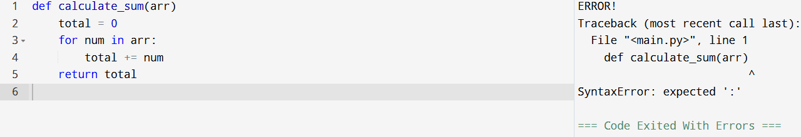
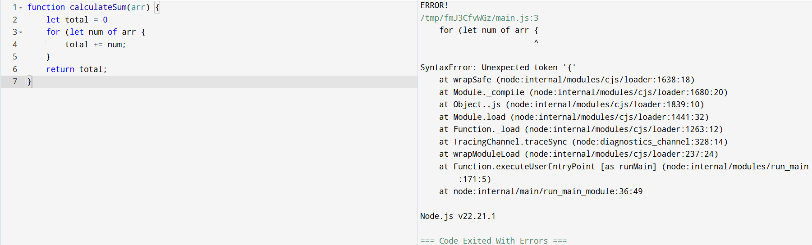
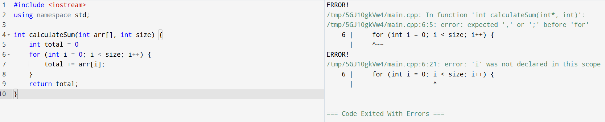
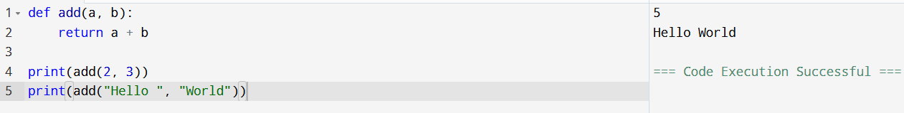
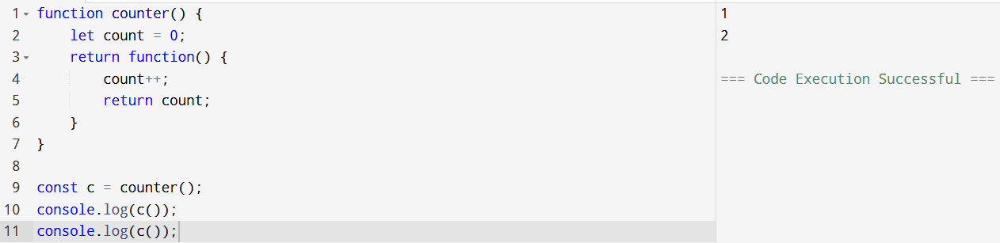
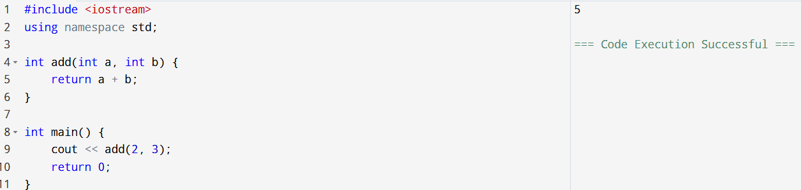
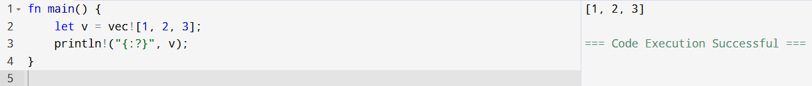
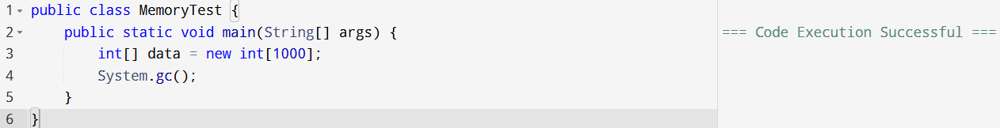
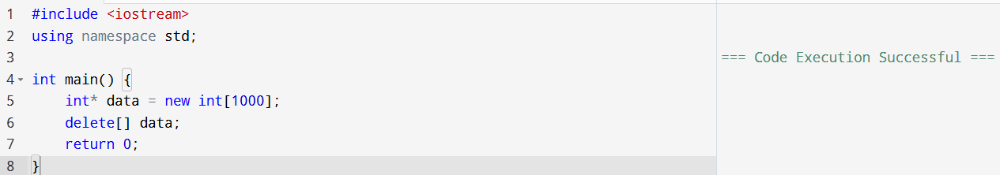

# Assignment 2: Syntax, Semantics, and Memory Management

## Course
Advanced Programming Languages

## Description
This repository contains source code and screenshots for Assignment 2.  
The assignment explores:
- Syntax errors in Python, JavaScript, and C++
- Semantic differences such as type systems and scope
- Memory management approaches in Rust, Java, and C++

---

## Repository Structure

```
Assignment-2-Syntax-Semantics-Memory/
│
├── Part1_Syntax_Semantics/ 
│   ├── python_error.py
│   ├── python_semantics.py
│   ├── javascript_error.js
│   ├── javascript_semantics.js
│   ├── cpp_error.cpp
│   └── cpp_semantics.cpp
│
├── Part2_Memory_Management/
│   ├── rust_memory.rs
│   ├── java_memory.java
│   └── cpp_memory.cpp
│
├── ScreenShots/
│   ├── Part_1/
│   │   ├── python_error.png
│   │   ├── python_semantics.png
│   │   ├── javascript_error.png
│   │   ├── javascript_semantics.png
│   │   ├── cpp_error.png
│   │   └── cpp_semantics.png
│   │
│   └── Part_2/
│       ├── rust_memory.png
│       ├── java_memory.png
│       └── cpp_memory.png
│
└── README.md
```

---

## Part 1: Syntax and Semantics

### Syntax Error Demonstrations

#### Python Syntax Error
- Source Code: `Part1_Syntax_Semantics/python_error.py`
- Screenshot:  


#### JavaScript Syntax Error
- Source Code: `Part1_Syntax_Semantics/javascript_error.js`
- Screenshot:  


#### C++ Syntax Error
- Source Code: `Part1_Syntax_Semantics/cpp_error.cpp`
- Screenshot: 


---

### Semantic Examples

#### Python Semantics
- Source Code: `Part1_Syntax_Semantics/python_semantics.py`
- Screenshot:  


#### JavaScript Semantics
- Source Code: `Part1_Syntax_Semantics/javascript_semantics.js`
- Screenshot:  


#### C++ Semantics
- Source Code: `Part1_Syntax_Semantics/cpp_semantics.cpp`
- Screenshot:  


---

## Part 2: Memory Management

### Rust Memory Management
- Source Code: `Part2_Memory_Management/rust_memory.rs`
- Screenshot:  


### Java Memory Management
- Source Code: `Part2_Memory_Management/java_memory.java`
- Screenshot:  


### C++ Memory Management
- Source Code: `Part2_Memory_Management/cpp_memory.cpp`
- Screenshot:  


---

## Tools Used
- [Programiz](https://www.programiz.com/) Online Compilers of Rust,Python,C++,Java & JavaScript

---

## Author
Saikrishna Reddy Kasthuri